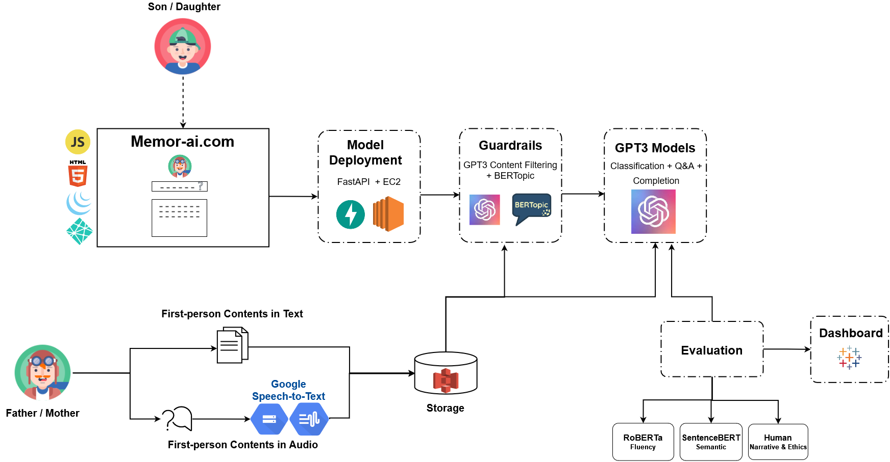

# MemorAI

## Fall 2021 - W210 Capstone

### Team Members:

- Alice Hua, [@alicehua11](https://github.com/alicehua11/)

- Tim Chen, [@yintrigue](https://github.com/yintrigue)

- Ajit Barhate, [@ab-Spark](https://github.com/ab-Spark)

This repository contains our Capstone project ***MemorAI*** for course W210 - Capstone at the UC Berkeley School of Information.  
Project Link: https://www.ischool.berkeley.edu/projects/2021/memorai-memories-your-loved-ones

### Project Folder Structure

- `backend`: a folder for infrastructure codes
- `data`: a folder for training data and evaluation reports for the different models
- `frontend`: a folder for files related to our interactive platform (UI)
- `images`: a folder for project-related images including sample responses
- `notebooks`: a folder for all jupyter notebooks used throughout the project
- `presentations`: a folder for all three presentations throughout the project
- `survey`: a folder for initial project survey results

### Introduction

*MemorAI* is an interactive platform that allows people to know the life stories told by their loved ones, even after they are long gone. Using both public and private first-person content including interviews, blogs, books, and other media sources, we leverage [OpenAI's GPT3](https://openai.com/) for classifying and answering questions about the loved ones' life stories in their likeness. Additionally, latest NLP models and datasets are explored for building guardrails and evaluation framework for the platform. The *MemorAI* team hopes to help people preserve and cherish the life stories of their loved ones using novel machine learning techniques.

### Project Summary

Our project aimed to provide an interactive platform that's powered by the OpenAI GPT3 (Generative Pre-trained Transformer 3). We explored the strengths and limitations of this language model by providing its first-person content data of a person. We picked Alex Honnold for our MVP because Alex is a potential candidate for our product being a professional rock climber, a high risk career, and a young parent at the same time. His data comprised of his books, Tedtalk, online interviews and podcasts. We transcribed them to text that GPT3 can ingest.

To protect the customers from potential false information or inaccurate statements from our model, we implemented Content Filtering and a BERTopic models as a guardrail system that would evaluate the question (input) and response (output) as part of the interaction. If a question contains offensive language and or is not relevant to our training data of the person, we politely decline to answer. 

We also distinguish two types of question, factual and non-factual to improve the appropriate response. A factual question such as "who is your dad?" is answered via a GPT3 Q&A model and a non-factual question such as "how do you deal with fear when free soloing?" is answered via a GPT3 Completion model. In both cases, the question (input) would need to pass our guardrail models first before getting classified by our GPT3 Classification model into either type of question. 

We evaluated the 4 models for relevancy (sBERT) and fluency (RoBERTa), as well as narrative and ethics using four sets of test questions: Question Classifier for our Classification model, Inference Q&A and Abstract Q&A for our Completion model, finally Factual Q&A for our Q&A model. We compared across 32 models of Completion by varying the hyperparameters and completion parameters. Completion model was the only one that we tuned, other models like Classification and Q&A were used with few-shot learning where we provided examples at inference time. 

Few-shot learning capability of GPT3 is notably advantage for our application where first-person content data is limited because people don't generally keep quality journal for themselves. Ideally, we would interview the customer over many sessions to get a sufficient picture of their life before feeding into the models. This data is also curated by them for quality control, we do not consider social media data which are superficial and may not be what our customer wants to be remembered with.

Overall, our MVP shows that data science and machine learning can provide an intelligent solution for people to rejoice in memories of their loved ones. Our work is only part of the progress in the world of conversational AI. We would like to remind the readers that we do not claim nor try to convince that we have a perfect model of your loved one but we want to convey our exploration in how much we can capture a person given limited data while learning a few things along the way.

### Challenge 

- Small training data. Time intensive to interview & validate transcription
- GPT3 API limitations on fine-tuning and parameters
- GPT3 responses are not deterministic, different responses for the same question
- Factual evaluation metric other than Recall
- Threshold for BERTopic similarity being probabilistic 

### Pipeline

### Result 

Visit our [Dashboard](https://www.memor-ai.com/dashboard.html)!

| Response Models     | Test Set                       | Performance                                         |
| ------------------- | ------------------------------ | --------------------------------------------------- |
| GPT3 Classification | Question Classifier            | F1: 0.88 Recall: 1.0                            |
| GPT3 Completion     | Inference Q&A Abstract Q&A | Fluency: 0.54  Relevancy: 0.46 Ethics: 0.96 |
| GPT3 Q&A            | Factual Q&A                    | Recall: 0.83 Ethics: 0.97                       |

### Future Work

- Include images and videos along with responses for a complete product
- Automate transcribe data processing
- Explore other Factual and Non-factual evaluation techniques
- Explore future use cases such as medical diagnosis and domain-specific conversational AI 

### References

- [Language Models are Few-Shot Learners](https://arxiv.org/abs/2005.14165)
- [OpenAI GPT-3 API documentation](https://beta.openai.com/docs/engines)
- [Exploring GPT-3 book](https://learning.oreilly.com/library/view/exploring-gpt-3/9781800563193/cover.xhtml)
- [BERTopic implementation](https://github.com/MaartenGr/BERTopic)
- [Universal Sentence Encoder](https://tfhub.dev/google/universal-sentence-encoder/4)
- [Beyond Accuracy: Behavioral Testing of NLP models with CheckList](https://arxiv.org/abs/2005.04118 )
- [Identifying Well-formed Natural Language Questions](https://arxiv.org/abs/1808.09419 )
- [Salesken Wellformedness](https://huggingface.co/salesken/query_wellformedness_score )
- [Sentence-BERT: Sentence Embeddings using Siamese BERT-Networks](https://arxiv.org/abs/1908.10084)

### Acknowledgement

We would like to acknowledge the following individuals for their advice and guidance throughout the project: 

- Colorado Reed
- David Steiner
- Gurdit Chahal
- Joyce Shen
- Judge Hiciano
- Robert Louka
